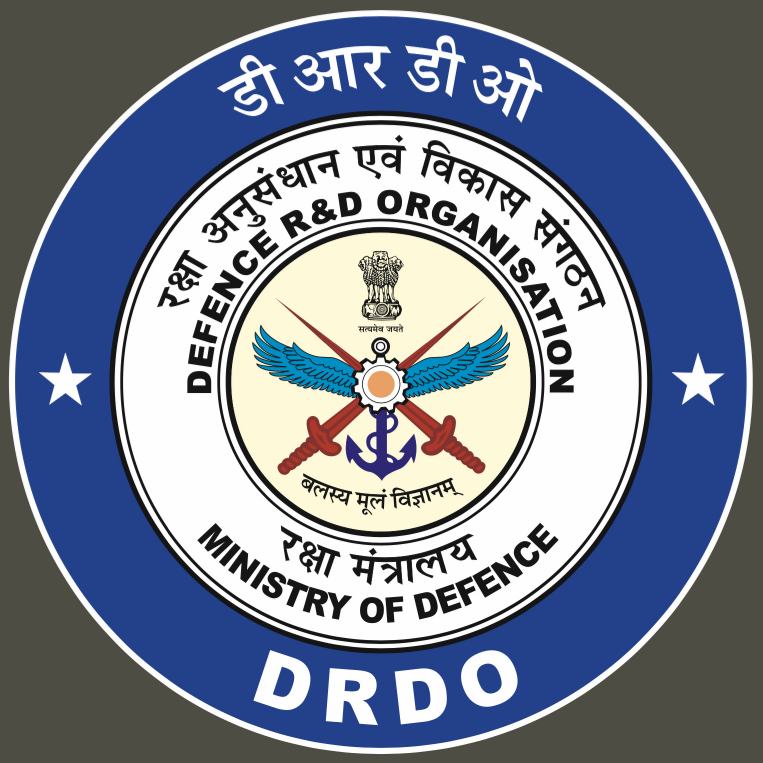

<table style="width:100%;">
  <tr>
    <td>
      <h1 style="color: #00008B">AMC Monitoring Portal</h1>
    </td>
    <td style="width: 150px;">
      
    </td>
  </tr>
</table>


**Organization:** ADRDE (DRDO), Agra </br>
**Description:** Internship team project </br>
**Internship Duration:** 4 Weeks </br>
**Team Size:** 9 Members </br>


## Project Overview
The AMC (Annual Maintenance Contract) Monitoring Portal is a task management system designed to efficiently oversee, schedule, and report daily, weekly, and monthly maintenance activities under AMC agreements. The portal provides role-based access, real-time dashboards, alerts, and compliance tracking to streamline IT infrastructure maintenance.

### Key Features
- **Dashboard Overview**
- **Task Categories**
- **Task Assignment & Scheduling**
- **Task Completion Tracking**
- **Reminders and Alerts**
- **Maintenance History**


## Repository Structure & Branching
```
main                 
└─ dev               
   ├─ frontend/
   │  ├─ login-page
   │  └─ to-be-added-soon
   ├─ backend/
   │  ├─ to-be-added-soon
   │  └─ to-be-added-soon
   └─ database/
      ├─ to-be-added-soon
      └─ to-be-added-soon
```

## Branching Guidelines

1. **Base Branches**
   - `main`: Protected, deployable.
   - `dev`: Protected, integration for all feature work.
2. **Feature Branches**
   - Create off `dev`: `area/feature-name` (e.g. `frontend/login-page`).
   - Commit frequently with clear messages: `FE: add login form validation`.
3. **Pull Requests**
   - Target branch: `dev`. `"KEEP IT IN MIND ALWAYS"`
   - Require at least 1 review before merge.
   - Use **Squash & Merge** to keep history clean.


## Contribution
1. Fork the repository.
2. Create a feature branch off `dev`.
3. Commit your changes.
4. Push to your fork.
5. Open a Pull Request targeting `dev`.

Please follow this branching guidelines.

Additional notes will be added in the `/docs` folder.

## 


_Thank you for coming to contribute and putting this project on a way to success!_
